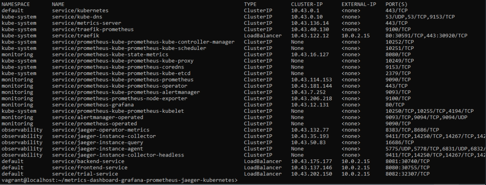
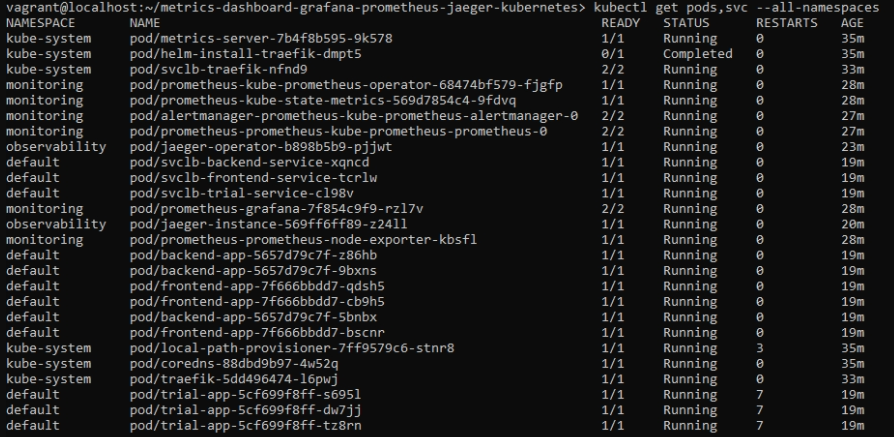
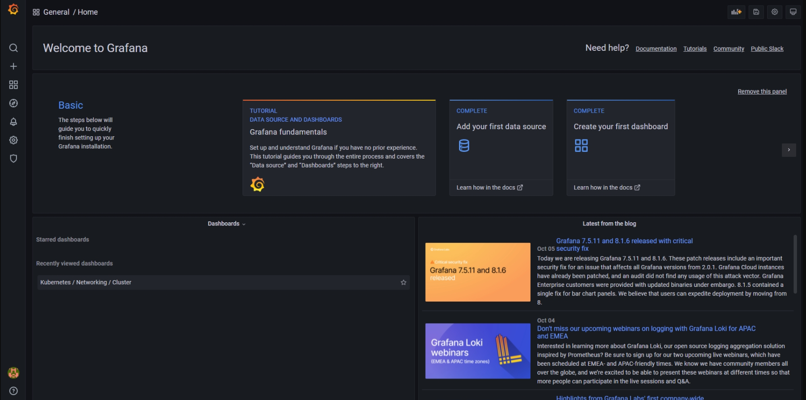
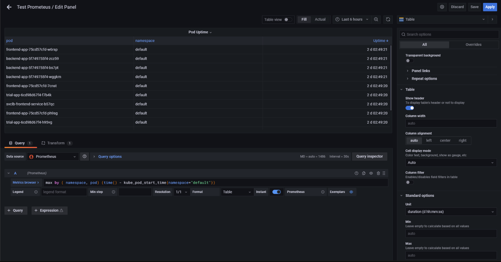
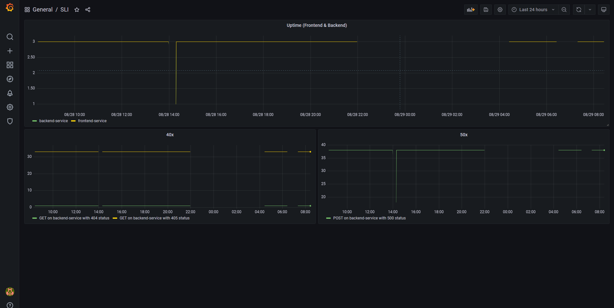
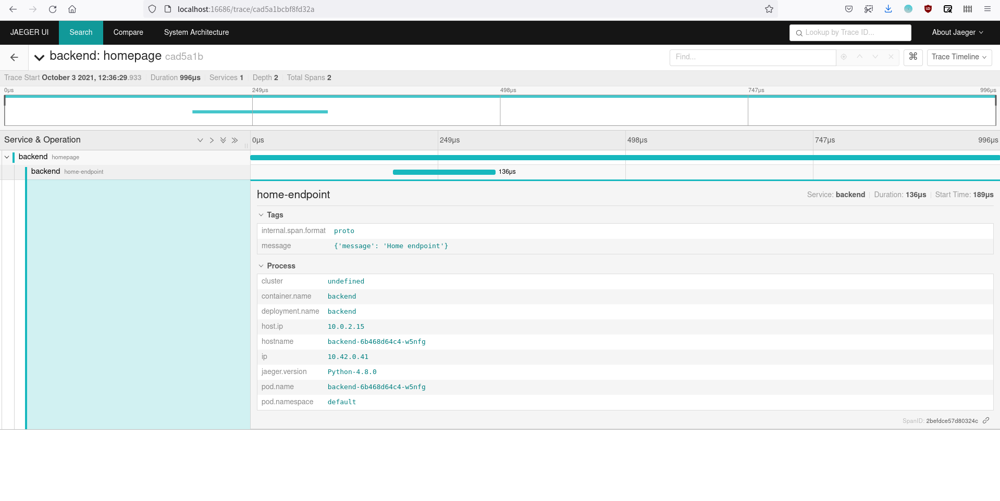
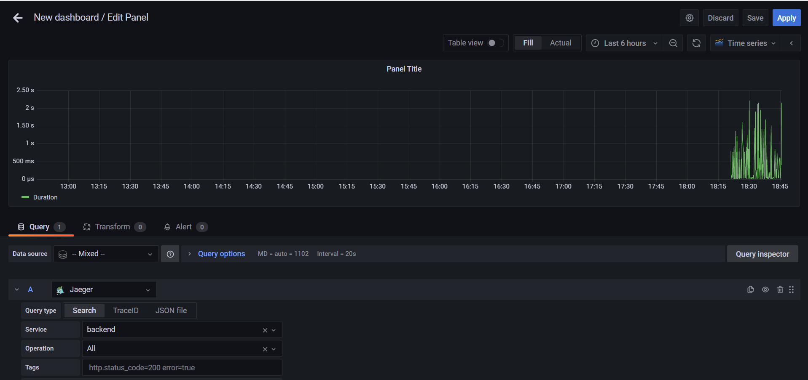
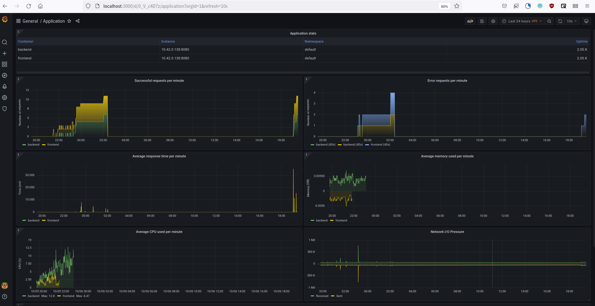

**Note:** For the screenshots, you can store all of your answer images in the `answer-img` directory.

## Verify the monitoring installation

*TODO:* run `kubectl` command to show the running pods and services for all components. Take a screenshot of the output and include it here to verify the installation

## Setup the Jaeger and Prometheus source
*TODO:* Expose Grafana to the internet and then setup Prometheus as a data source. Provide a screenshot of the home page after logging into Grafana.

## Create a Basic Dashboard
*TODO:* Create a dashboard in Grafana that shows Prometheus as a source. Take a screenshot and include it here.

## Describe SLO/SLI
*TODO:* Describe, in your own words, what the SLIs are, based on an SLO of *monthly uptime* and *request response time*.

A specific metric used to measure performance of the service. ie.

- Backend service have 99.99% uptime in the month
- Response time for frontend service less than 0.5 second for 99.99% request

## Creating SLI metrics.
*TODO:* It is important to know why we want to measure certain metrics for our customer. Describe in detail 5 metrics to measure these SLIs. 

- Uptime: Percentage of time of a machine / service has been working and available.
- Saturation: Disk, cpu and ram utilization if either one of those is used at its maximum our response time would decrease due to lack of resources 
- Traffic: The amount of stress on a system from demand (such as the number of HTTP requests/second).
- Error: rate or the number of errors requests during a month - errors take away from our uptime so we need to monitor them.
- Latency: or the amount of time in ms it takes for a request to be proccessed and returned to the requester.

## Create a Dashboard to measure our SLIs
*TODO:* Create a dashboard to measure the uptime of the frontend and backend services We will also want to measure to measure 40x and 50x errors. Create a dashboard that show these values over a 24 hour period and take a screenshot.

## Tracing our Flask App
*TODO:*  We will create a Jaeger span to measure the processes on the backend. Once you fill in the span, provide a screenshot of it here. Also provide a (screenshot) sample Python file containing a trace and span code used to perform Jaeger traces on the backend service.

## Jaeger in Dashboards
 Now that the trace is running, let's add the metric to our current Grafana dashboard. Once this is completed, provide a screenshot of it here.

## Report Error
 Using the template below, write a trouble ticket for the developers, to explain the errors that you are seeing (400, 500, latency) and to let them know the file that is causing the issue also include a screenshot of the tracer span to demonstrate how we can user a tracer to locate errors easily.

TROUBLE TICKET

Name: POST /star request on Backend Service 500 Error

Date: 9/25/2022

Subject: MongoDB connection failure

Affected Area: /star API endpoint of Backend app

Severity: High

Description: Star endpoint accepts POST requests but is unable to connect to MongoDB database.

## Creating SLIs and SLOs
 We want to create an SLO guaranteeing that our application has a 99.95% uptime per month. Name four SLIs that you would use to measure the success of this SLO.

- More than 99% of monthly requests should be successful and error free
- Service uptime should >= 99.999 %
- Service latency should less than 0.5 seconds for >= 99.99% requests
- The server resources should not exceed 90% utilization per month

## Building KPIs for our plan
 Now that we have our SLIs and SLOs, create a list of 2-3 KPIs to accurately measure these metrics as well as a description of why those KPIs were chosen. We will make a dashboard for this, but first write them down here.

- Response latency should less than 0.5 seconds for >= 99.99% requests
- Server Uptime > 99.95%
- CPU Utilization <= 90%
- Average response time should be less than 0.75 seconds
- Error per second <= 0.04% of the request
- Pod uptime >= 99.999 %
- Success repsonse rate >= 99.99% request
- Memory Utilization <= 90%

## Final Dashboard
 Create a Dashboard containing graphs that capture all the metrics of your KPIs and adequately representing your SLIs and SLOs. Include a screenshot of the dashboard here, and write a text description of what graphs are represented in the dashboard.  

